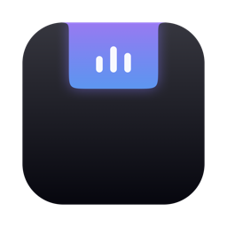

<div align="center">



# Wicit

**MacBook çentiğini bir üretkenlik merkezine dönüştürür.**

Notch'a dokun → widget rafı aşağı aksın: müzik, pano geçmişi, AirDrop, takvim, hava durumu ve dahası.


*Türkçe · English — arayüz her iki dili de destekler, anında geçiş*

</div>

---

## ✨ Özellikler

| | Özellik | Ayrıntı |
|:--:|---|---|
| 🎵 | **Now Playing** | Apple Music, Spotify, **Chrome/Safari dahil her kaynak** — kapak sanatı, canlı ilerleme çubuğu, oynatma kontrolleri. Panel kapalıyken notch'un yanında mini kapak + animasyonlu ekolayzer |
| 📥 | **AirDrop & Pocket** | Dosyayı notch'a sürükle: AirDrop'a gönder ya da geçici rafa bırak, sonra istediğin yere geri sürükle |
| 📋 | **Pano Geçmişi** | Son / Görseller / Renkler / Metin / Dosyalar / Favoriler — kaynak uygulama ikonu ve zaman damgasıyla. Yeniden başlatınca kaybolmaz, kartlar dışarı sürüklenebilir |
| 📜 | **Prompter** | Metni yapıştır, her zaman üstte duran pencerede 60fps akıcılıkla kaydır. Hız ve yazı boyutu canlı ayarlanır |
| ⏱ | **Sayaç** | Preset veya özel süre; bitince ses + bildirim. Panel kapalıyken notch'un yanında canlı geri sayım |
| 📅 | **Bugünkü Etkinlikler** | Takvimindeki toplantılar, takvim renkleriyle (EventKit) |
| 🌤 | **Animasyonlu Hava** | Dönen güneş, yağan damlalar, çakan şimşek — IP tabanlı konum, API anahtarı gerektirmez, °C/°F |
| 🚀 | **Hızlı Uygulamalar** | Dock'undan otomatik ya da tamamen özelleştirilebilir 2×3 başlatıcı |
| 🎨 | **Space'e Özel Tema** | Her sanal masaüstünün kendi rengi ve arka plan görseli — Space değişince panel de değişir |
| ⚡️ | **Hızlı Eylemler** | Damlalık (hex → pano) · ekran görüntüsü · kafein modu · pil göstergesi |

**Kısayol:** `⌥ + Boşluk` paneli her yerden açar/kapatır.

---

## 🚀 Kurulum

```bash
git clone git@github.com:kancaba/wicit-notch.git
cd wicit-notch
./build.sh run
```

Hepsi bu. Script derler, `.app` paketini kurar, imzalar ve başlatır.

| Komut | Ne yapar |
|---|---|
| `./build.sh` | Debug derleme + paket |
| `./build.sh release` | Optimize derleme |
| `./build.sh run` | Derle + yeniden başlat |

> **Gereksinimler:** Apple Silicon MacBook (notch'lu), macOS 14+, Xcode Command Line Tools.
> Notch'suz ekranlarda simüle bir çentikle çalışır.

### İzinler

| İzin | Ne için | Zorunlu mu |
|---|---|:--:|
| Takvim | Bugünkü etkinlikler widget'ı | Hayır |
| Bildirim | Sayaç bitiş uyarısı | Hayır |
| Ekran Kaydı | Ekran görüntüsü hızlı eylemi | Hayır |

Hiçbiri verilmezse uygulamanın kalanı aynen çalışır.

---

## 🧠 Nasıl çalışıyor?

<details>
<summary><b>Mimari özeti</b> (tıkla)</summary>

<br>

- **Konumlama** — `NSScreen.auxiliaryTopLeftArea/RightArea` (public API) ile notch'un piksel geometrisi alınır; borderless bir `NSPanel` menü çubuğunun üstünde, tam notch'un altında durur. Kapalıyken pencere notch boyutuna küçülür → ekranın geri kalanı tamamen tıklanabilir kalır.
- **Now Playing** — [mediaremote-adapter](https://github.com/ungive/mediaremote-adapter) (BSD-3): Apple imzalı `/usr/bin/perl` üzerinden MediaRemote verisini JSON olarak akıtır. macOS 15.4+ kısıtlamalarından etkilenmez, izin penceresi gerektirmez. `Vendor/` altında kaynaktan derlenmiş halde gelir.
- **Pano** — macOS pano değişikliği bildirimi sunmadığı için `NSPasteboard.changeCount` 500ms'de bir yoklanır (Maccy yaklaşımı).
- **Space tespiti** — private SkyLight `SLSGetActiveSpace`, `dlsym` ile dinamik yüklenir; sembol bir gün kaybolursa uygulama tek-tema moduna düşer, çökmez.
- **Hava** — Open-Meteo + ipapi.co; ikisi de anahtarsız.

```
Sources/Wicit/
├── App/        LSUIElement ajanı, durum çubuğu, servis başlatma
├── Notch/      Geometri, pencere kontrolü, sürükleme oturumları
├── Views/      SwiftUI: raf, pano, sayaç, prompter, ayarlar…
└── Services/   Clipboard, NowPlaying, Weather, Events, Spaces, Theme…
```

</details>

> [!NOTE]
> MediaRemote ve Space kimliği private API'lere dayandığı için Wicit **App Store hedeflemez** — dağıtım yolu notarize edilmiş doğrudan indirmedir (boring.notch, NotchNook ile aynı model).

---

## 🗺 Yol Haritası

- [x] Notch paneli, AirDrop + Pocket, pano, sayaç, prompter, widget'lar
- [x] Space'e özel tema & arka plan, TR/EN, global kısayol
- [ ] Sistem monitörü kartı (CPU / RAM / disk)
- [ ] Pomodoro modu
- [ ] Pano içinde arama
- [ ] Çoklu ekran desteği
- [ ] DMG + notarize + Sparkle güncellemeleri

---

## 🙏 Teşekkürler

- [ungive/mediaremote-adapter](https://github.com/ungive/mediaremote-adapter) — evrensel now-playing köprüsü
- [boring.notch](https://github.com/TheBoredTeam/boring.notch) & [Maccy](https://github.com/p0deje/Maccy) — mimari ilham

<div align="center">
<sub>Mersel · macOS 26 üzerinde geliştirildi</sub>
</div>
